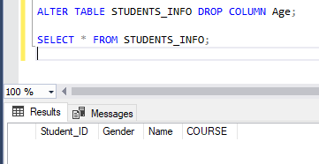
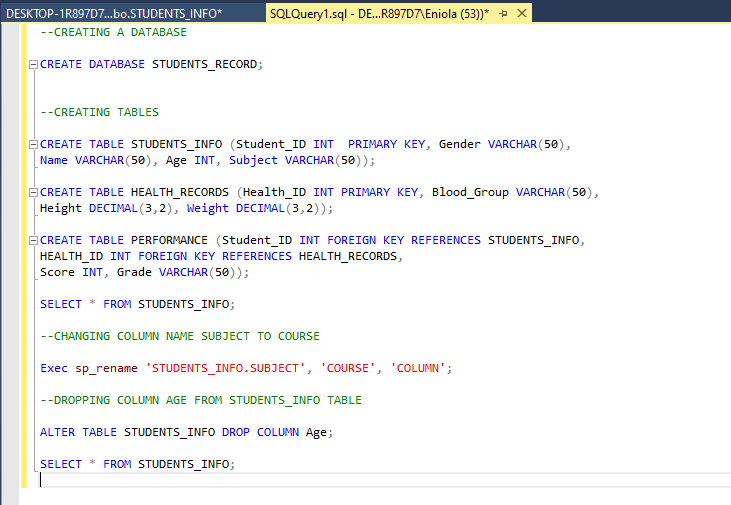

# Analysis of Students Records using SQL

## Introduction
After an introductuctory session in SQL, an understanding of the basics of getting started with SQL is being tested with this analysis.

## Analysis/Result of Analysis

This started with creating a Database named “Students Record”. Please find below the SQL query used for this:

After this, the following tables were then added to the database "Students Record"
- Students Info (Student ID PK, Gender, Name, Age, Subject)
- Health records (Health ID PK, Blood Group, Height, Weight)
- Performance (Student ID FK, HEALTH FK,  Score, Grade)
  

A constraint that prevents the ID and Subject from taking null values was added

Also, the following modifications were added to the Students Info table:
- Column name was changed from ‘’Subject” to ‘’Course”

- The “Age” column was dropped

  

Kindly see below, the details of all queries used in this analysis.
  

 
 ## Conclusion
Based on the analysis above, an understanding of the basics of SQL has been shown which is a good foundation into the retrieving data using SQL which is key to data analysis. 

 

